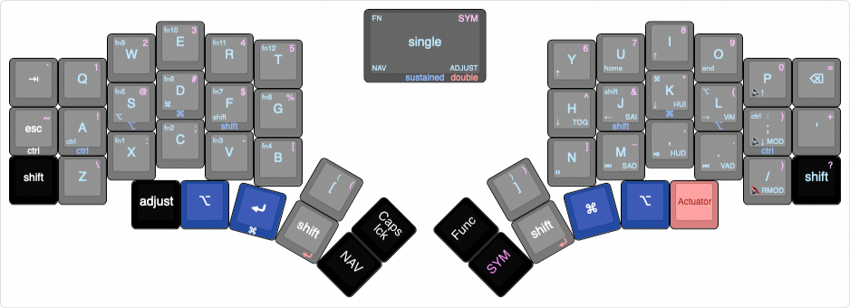

 # Kolkman's XOLX keymap
 
 This keymap is based on the default Kyria Keymap with a few modifications.
 
*   Tapdance on the space keys, to mimic as enter keys
*   Simultaneous space press activates CAPS_WORDS.
*   Control Option Command Shift - [Modrow](https://precondition.github.io/home-row-mods) (Only on the QWERTY keyboard)
*   Removed  CTRL on hold from the quote key.
*   Parentheses on the square brackets symbol layer
*   Option Command order on the thumb row swapped.
*   Power led [on for Caps lock](https://docs.splitkb.com/hc/en-us/articles/5799711553820-Power-LED).
*   RGB lightlayers, see the [feature_rgblight.md](https://github.com/qmk/qmk_firmware/blob/master/docs/feature_rgblight.md) with command option shift and control providing light effects.
*   Configurable removal of DVORAK and COLEMAK layers (Reenable by defining ENABLE_DVORAK or ENABLE_COLEMAK)
*   A custom XOLX logo 

### Layer layout     

Keyboard layout edited with: [keyboard layout editor](http://www.keyboard-layout-editor.com/#/gists/f7e4c83d47951cabcbdc227a47d7e257)
